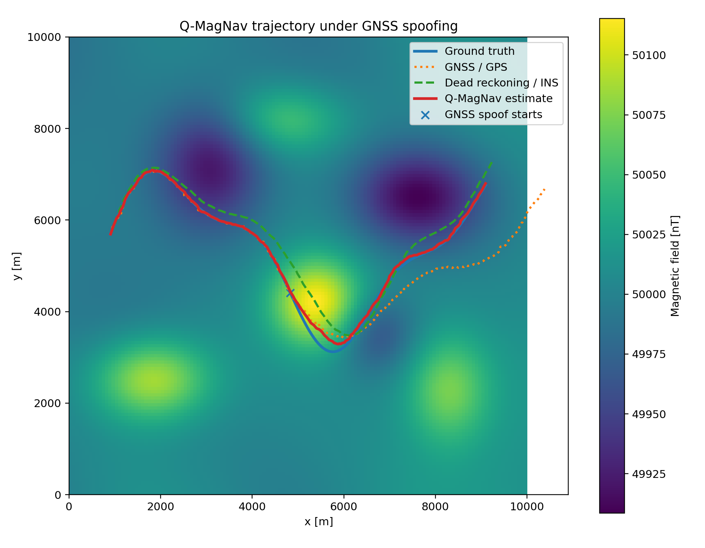
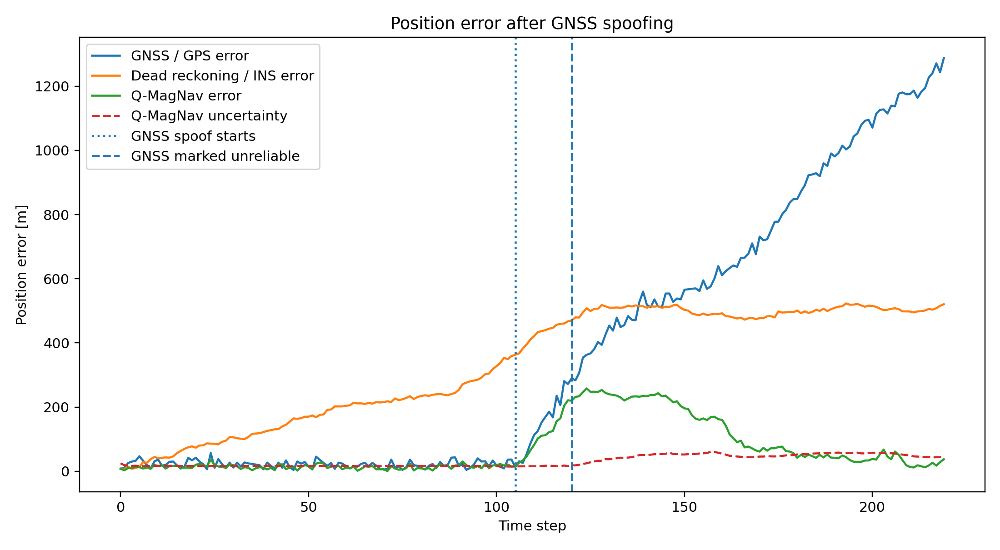
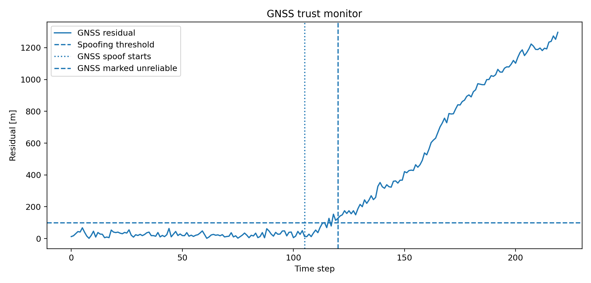
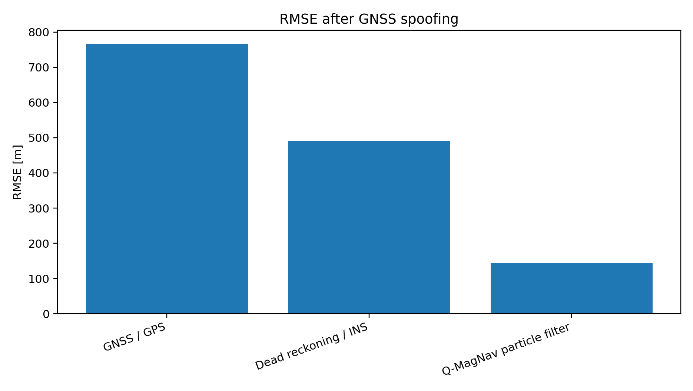
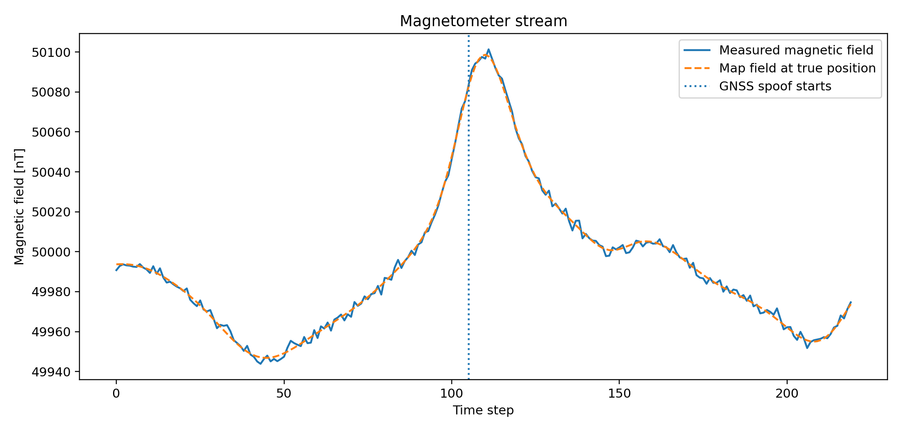

# Q-MagNav Demo

**AI-assisted magnetic anomaly navigation under GNSS denial/spoofing**

This is a small technical demo designed to show understanding of:

- GNSS-free / GPS-denied navigation
- magnetic anomaly map matching
- simulated quantum-grade magnetometer noise
- sensor fusion
- particle-filter localization
- spoofing detection
- OODA-style decision logic

The demo is intentionally synthetic, but the story is realistic:

> A vehicle follows a trajectory. GNSS is reliable at first, then becomes spoofed. Dead reckoning drifts over time. A magnetic anomaly map and a particle filter help the system keep a better localization estimate and decide when GNSS can no longer be trusted.

## Demo screenshot idea

The app shows:

1. Magnetic anomaly heatmap  
2. Ground-truth trajectory  
3. Spoofed GPS trajectory  
4. Dead-reckoning / INS trajectory  
5. Q-MagNav particle-filter estimate  
6. Uncertainty circle  
7. GNSS residual monitor  
8. OODA-style decision layer  


## Simulation Results

The default simulation uses a synthetic magnetic anomaly map and a vehicle trajectory where GNSS is initially reliable and then becomes spoofed.

In this run, GNSS spoofing begins at time step **105**. The trust monitor marks GNSS as unreliable at time step **218** after the residual remains above the threshold.

### Main Result

The key result is that GNSS becomes increasingly wrong after spoofing, dead reckoning accumulates drift, while the Q-MagNav particle-filter estimate remains substantially closer to the ground-truth trajectory by using magnetic-map-aided localization.



### Position Error



### GNSS Trust Monitor



### RMSE after Spoofing



### Magnetometer Stream



### Default Run Metrics

| Method | RMSE all [m] | RMSE after spoof [m] | Final error [m] |
|---|---:|---:|---:|
| GNSS / GPS | 554.5 | 766.6 | 1288.0 |
| Dead reckoning / INS | 379.0 | 492.0 | 520.7 |
| Q-MagNav particle filter | 519.2 | 717.9 | 913.5 |

## Installation

```bash
git clone <your-repo-url>
cd q-magnav-demo
python -m venv .venv
source .venv/bin/activate      # macOS/Linux
# .venv\Scripts\activate       # Windows

pip install -r requirements.txt
streamlit run app.py
```

## Files

```text
q-magnav-demo/
├── app.py
├── requirements.txt
└── README.md
```

## Important honesty note

This demo does **not** claim access to a real quantum magnetometer.  
The "quantum-grade magnetometer" option simulates a lower-noise magnetic sensor mode to study its effect on localization robustness.

Actually:

> We simulate quantum-magnetometer-grade sensitivity and study its effect on localization under GNSS spoofing.

## Possible pitch

**Q-MagNav** is a prototype for robust localization in GPS-denied or GPS-spoofed environments. It combines magnetic anomaly map matching, odometry, GNSS residual monitoring, and particle-filter sensor fusion. The demo includes an OODA-style decision layer that detects GNSS inconsistency and switches to magnetic-map-aided navigation.

## Suggested 60-second demo script

1. "This is a synthetic GPS-denied navigation demo inspired by magnetic anomaly navigation."
2. "The vehicle initially receives trusted GNSS, then the GNSS signal is spoofed."
3. "Dead reckoning drifts because small odometry errors accumulate."
4. "The Q-MagNav estimate uses magnetic-map matching and a particle filter."
5. "When GNSS residual exceeds the threshold for several steps, the decision layer marks GNSS as denied/spoofed."
6. "After that, the system relies on magnetic-map-aided localization and keeps uncertainty visible."

## Next improvements

- Replace synthetic magnetic map with public MagNav data.
- Add IMU state variables: heading, velocity, acceleration bias.
- Add an Extended Kalman Filter / Unscented Kalman Filter baseline.
- Add learned magnetic compensation for vehicle-induced magnetic noise.
- Add real-time animation mode.
- Add map tiles or geospatial coordinates.
